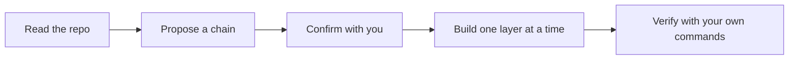

# Hedgehog Adopted Core ⭐

### Discipline for the Codebase You Already Have

Rewriting an existing project just to get AI-guided structure isn't
realistic. Most of the time, you need the discipline applied to what
you're changing next — not a migration of everything you already built.

This core does exactly that: it reads your repo, respects what's
already there, and enforces Hedgehog's build discipline on new work
only.



## What you get

- **No migration, no rewrite** — your stack, layout, and commands stay
  exactly as they are.
- **A build graph for new change only** — existing code is context to
  respect, never a node to touch uninvited.
- **Verification using your own tooling** — the checks that gate each
  layer are the commands your repo already runs.

## Built for real, existing projects

Reach for this core the moment you want scope and verify enforcement on
a codebase that already has real source files — "adopt this repo," "add
Hedgehog to my existing project," or any request to bring that
discipline to work you're already doing.

## Easy to install and use

Ask your agent:
*"Install Hedgehog on this repo"*

<details>
<summary>For your agent</summary>

```
npx @skyf0xx/hedgehog init
```

Hedgehog's planner selects this core automatically when the project
already has real source files. There's no install flag for it directly
— adoption reads the existing repo and proposes the chain itself.

Technical details: [ARCHITECTURE.md](ARCHITECTURE.md)
