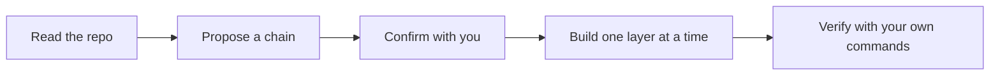

# Hedgehog Adopted Core ⭐

### Discipline for the Codebase You Have Now

Rewriting an existing project to get AI-guided structure isn't
realistic. What you need is that discipline applied to what you're
changing next, without touching everything you built before.

This core reads your repo, respects what's there, and enforces
Hedgehog's build discipline on new work.



## What you get

- **No migration, no rewrite.** Your stack, layout, and commands stay
  as they are.
- **A build graph for new change.** Existing code is context to
  respect, never a node to touch uninvited.
- **Verification using your own tooling.** The checks that gate each
  layer are the commands your repo runs today.

## Built for existing projects

Reach for this core the moment you want scope and verify enforcement on
a codebase with source files in it: "adopt this repo," "add Hedgehog to
my existing project," or any request to bring that discipline to work
you're doing now.

## Easy to install and use

Ask your agent:
*"Install Hedgehog on this repo"*

<details>
<summary>For your agent</summary>

```
npx @skyf0xx/hedgehog init
```

Technical details: [ARCHITECTURE.md](ARCHITECTURE.md)
